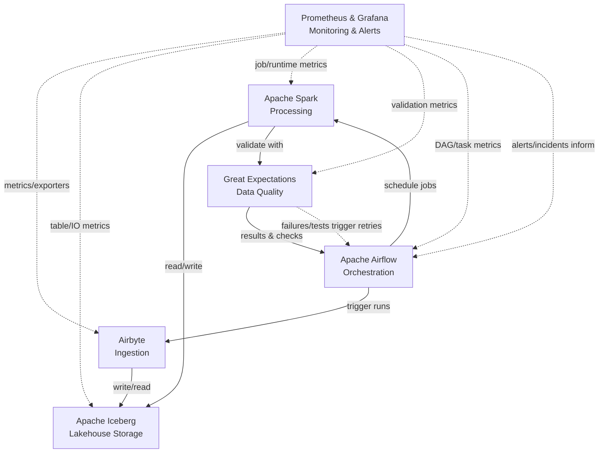

# Data Ingestion Pipeline PoC

## Overview
Enterprise-ready data pipeline for ingesting 30k suppliers + 30k parts with scaling demonstration to 300k each. Built for production deployment with comprehensive data quality validation and monitoring.

## Architecture Stack
- **Ingestion**: Airbyte (300+ connectors, CDC support)
- **Storage**: Apache Iceberg (ACID, time travel, multi-engine)
- **Processing**: Apache Spark (enterprise-grade transformations)  
- **Orchestration**: Apache Airflow (Python-native workflows)
- **Quality**: Great Expectations (validation gates)
- **Monitoring**: Prometheus + Grafana

## Performance Targets
- **Baseline**: 60k records in <20 minutes (4-node Spark cluster)
- **Scale**: 600k records in <60 minutes (12-node Spark cluster)
- **Data Quality**: 99% validation pass rate
- **Cost**: <3x resource increase for 10x data volume

## Data Contracts
- **Suppliers**: 23 fields including risk metrics, certifications, compliance flags
- **Parts**: 20 fields including qualified suppliers, costs, lead times
- **Validation**: PK uniqueness, FK integrity, business rules, freshness checks

## Key Features
- Multi-tenant isolation (tenant_id partitioning)
- Automatic schema evolution and drift handling  
- Quarantine pattern for data quality failures
- Complete audit trail and lineage tracking
- Idempotent processing with safe reruns

## Implementation Timeline [Subject to change]
- **Week 1-2**: Core pipeline development
- **Week 3-4**: Validation and monitoring setup
- **Week 5-6**: Scale testing and optimization